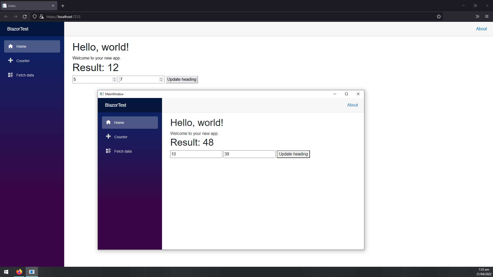

# Blazor + WPF + Class Library

Simple proof of concept project showing how to run a Blazor project in browser and locally through WPF while calling methods from an external class library.

## Requirements

- Windows
- .NET 6.0

## Run

1. `dotnet restore`
2. `cd WPFTest`
    1. Alternatively `cd BlazorTest`
3. `dotnet run`

## Screenshot

